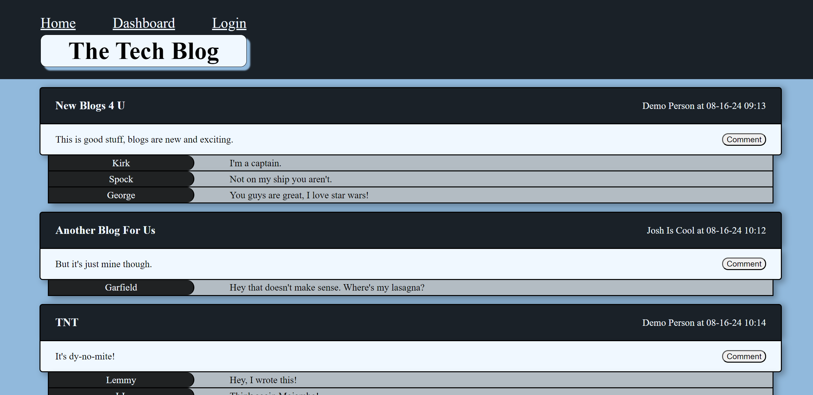
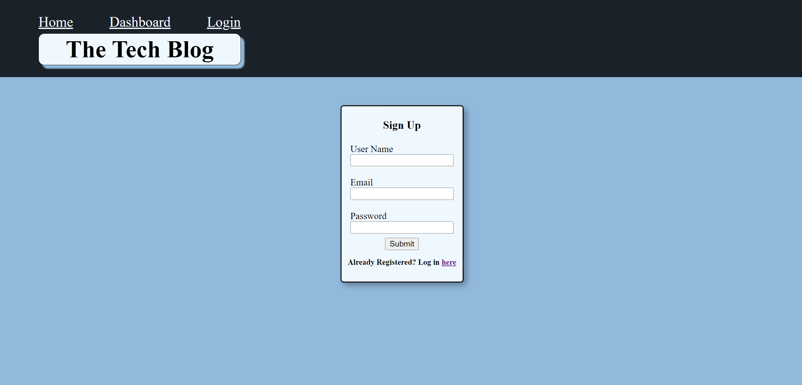
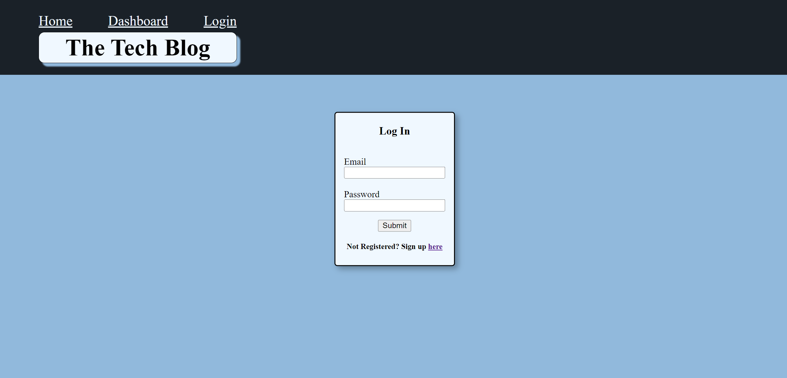
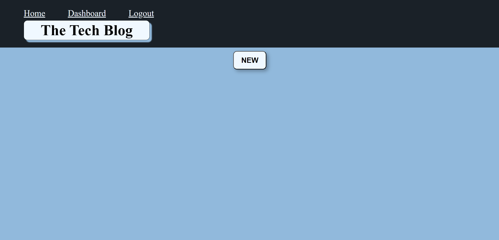
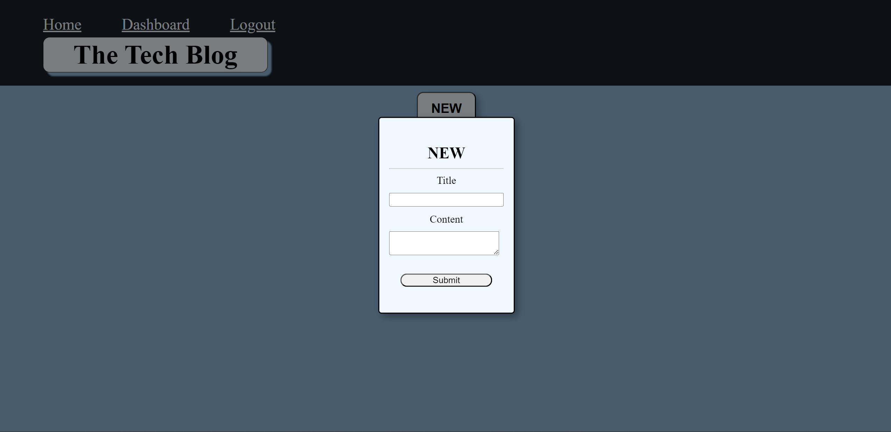
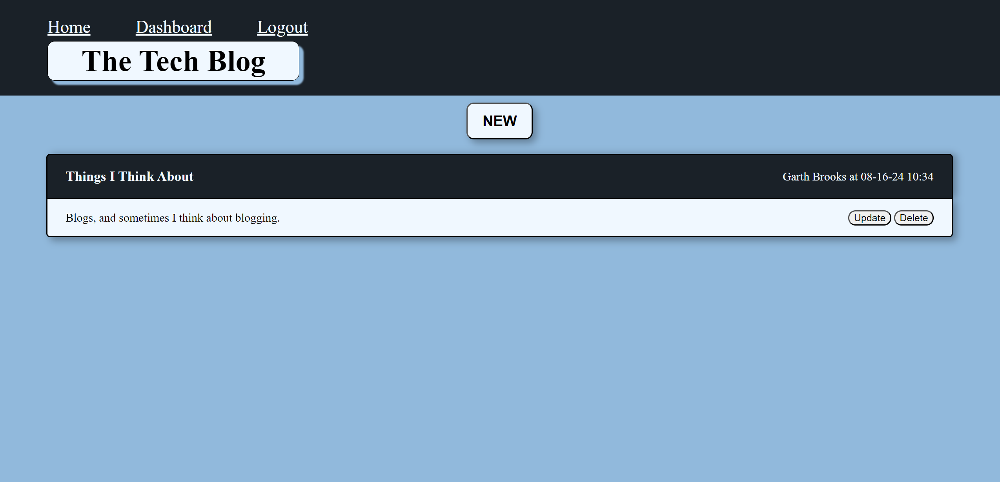
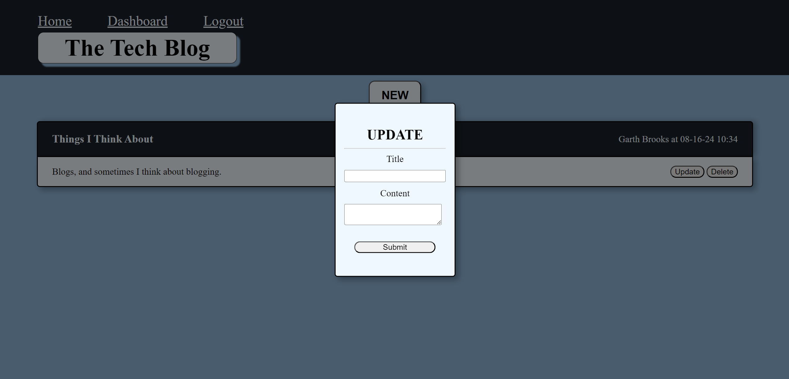
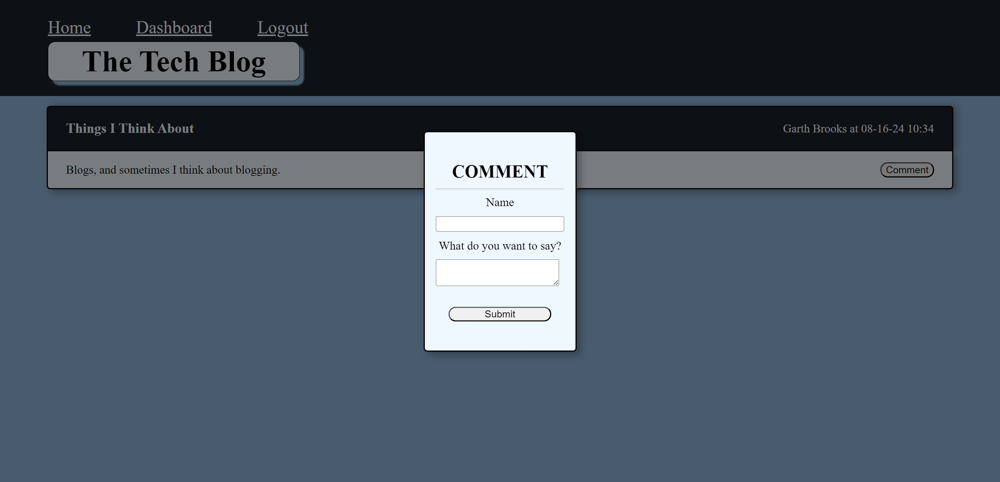
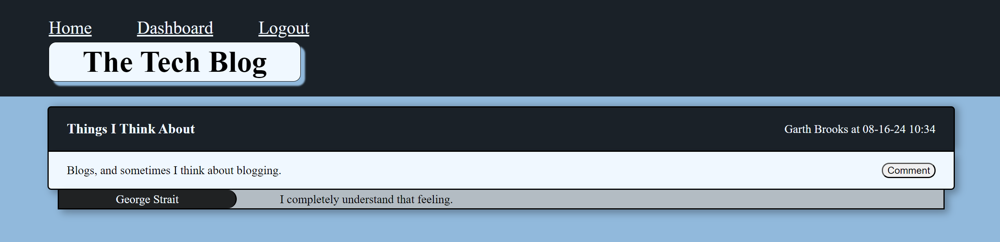

# tech-blog-14

Description: This repo was created to showcase a website that allows you to sign up, log in, create your own blog posts and also comment on other blog posts.

Installation: Install all necessary dependencies by running 'npm i' in your terminal, then run the node index.js file in seeds and finally run node server.js to start the application.

Usage: To use this repo, you can sign up, then log in, which will bring you to your own dashboard page. From here, you can create new blog posts, update your posts and also delete posts you don't want anymore. You can then go to the home page (which shows all posts from all users) and comment on those posts. You can also look through the code to see how the basic versions of these functions are written and work together.

Credits: Josh Stringer

License: Refer to the LICENSE in the repo.

Render Link: https://tech-blog-14-rjb6.onrender.com

